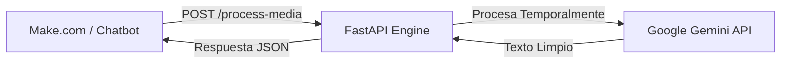

# La Remera EC - Vision & Audio AI Engine 🚀

Un microservicio de Inteligencia Artificial multimodal diseñado para dotar a chatbots (Make.com, n8n o webhooks) de capacidades de visión y audición utilizando la API de Google Gemini (`gemini-flash-latest`).

---

## ✨ Características Clave

- **🎙️ Procesamiento Multimodal:** Transcripción exacta de mensajes de voz y descripción inteligente de imágenes en tiempo real.
- **🔄 Integración Plug & Play:** Preparado para recibir payloads JSON desde plataformas de automatización mediante peticiones HTTP estándar.
- **🔒 Privacidad Garantizada (Zero Retention):** Descarga temporalmente los archivos para su análisis y los elimina inmediatamente de los servidores locales y de Google tras procesar la solicitud.

---

## 🖥️ Flujo de Operación



---

## ⚙️ Configuración y Despliegue Rápido

1. **Variable de Entorno:** Requiere `GEMINI_API_KEY` (obtenida en Google AI Studio).
2. **Ejecución Local:**
   ```bash
   pip install -r requirements.txt
   uvicorn main:app --reload
   ```
3. **Despliegue:** Totalmente compatible con plataformas como **Render**, **Railway** o **Heroku** usando la imagen de inicio por defecto de Python y configurando la variable de entorno.

---

## 🚀 API Endpoint

### `POST /process-media`
Procesa y analiza el archivo multimedia enviado.

- **Body (JSON):**
  ```json
  {
    "url": "https://enlace-al-archivo.com/audio-o-imagen.ogg",
    "media_type": "audio" // o "image"
  }
  ```
- **Response (JSON):**
  ```json
  {
    "status": "success",
    "text": "Transcripción del audio o descripción detallada de la imagen."
  }
  ```
