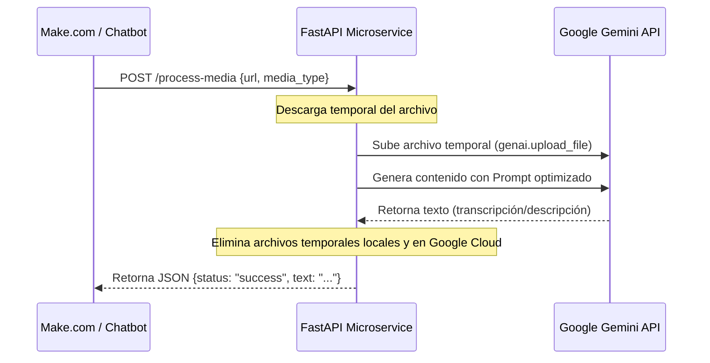

# La Remera EC - Vision & Audio AI Engine 🚀

Un microservicio de Inteligencia Artificial multimodal diseñado para integrarse con plataformas de automatización (como **Make.com**, **n8n** o webhooks personalizados). Permite la descripción detallada de imágenes y la transcripción exacta de audios utilizando la API de Google Gemini (`gemini-flash-latest`), optimizado para chatbots de atención al cliente y e-commerce.

---

## 📋 Tabla de Contenidos
- [Características Principales](#-características-principales)
- [Arquitectura de Integración](#%EF%B8%8F-arquitectura-de-integración)
- [Tecnologías Utilizadas](#%EF%B8%8F-tecnologías-utilizadas)
- [Estructura del Proyecto](#-estructura-del-proyecto)
- [Configuración y Despliegue](#-configuración-y-despliegue)
- [Uso de la API (Endpoint)](#-uso-de-la-api-endpoint)
- [Prácticas de Seguridad y Optimización](#-prácticas-de-seguridad-y-optimización)

---

## ✨ Características Principales

- **Procesamiento Multimodal**: Transcripción precisa de audios (ej. notas de voz de clientes) y análisis descriptivo de imágenes (ej. comprobantes, camisetas deportivas).
- **Integración No-Code/Low-Code**: Diseñado específicamente para ser invocado desde escenarios de Make.com mediante HTTP Requests simples.
- **Eficiencia y Velocidad**: Utiliza `gemini-flash-latest` para respuestas rápidas y de bajo costo.
- **Gestión de Archivos Efímeros**: Descarga y sube temporalmente los archivos para su análisis, garantizando la eliminación inmediata tanto en el servidor local como en la nube de Google tras procesar la solicitud.

---

## 🖥️ Arquitectura de Integración

El flujo de comunicación es directo, seguro y eficiente:



---

## 🛠️ Tecnologías Utilizadas

- **Backend Framework**: [FastAPI](https://fastapi.tiangolo.com/) (Python)
- **AI SDK**: [Google Generative AI SDK](https://github.com/google-gemini/generative-ai-python)
- **Validación de Datos**: [Pydantic](https://docs.pydantic.dev/)
- **Servidor ASGI**: [Uvicorn](https://www.uvicorn.org/)

---

## 📂 Estructura del Proyecto

```bash
├── main.py            # Servidor FastAPI y lógica principal del motor de IA
├── requirements.txt   # Dependencias de Python
└── README.md          # Documentación del proyecto
```

---

## ⚙️ Configuración y Despliegue

### 1. Variables de Entorno
El servicio requiere la siguiente variable para autenticarse con el SDK de Google:
- `GEMINI_API_KEY`: Tu clave de API de Google AI Studio.

### 2. Despliegue Local
Si deseas ejecutar el servicio de manera local para pruebas:

```bash
# 1. Clonar el repositorio
git clone https://github.com/Fabriziococca/Laremera.git
cd Laremera

# 2. Instalar dependencias
pip install -r requirements.txt

# 3. Configurar la API Key (Windows)
$env:GEMINI_API_KEY="tu-api-key-aquí"

# 4. Iniciar el servidor
uvicorn main:app --reload
```

El servidor estará disponible en `http://127.0.0.1:8000`. Puedes acceder a la documentación interactiva autogenerada en `http://127.0.0.1:8000/docs`.

### 3. Despliegue en Producción
Este microservicio está preparado para desplegarse fácilmente en plataformas cloud como **Render**, **Railway** o **Heroku**.
- **Comando de inicio**: `uvicorn main:app --host 0.0.0.0 --port $PORT`
- **Variable requerida**: Configurar `GEMINI_API_KEY` en la sección de variables de entorno de la plataforma elegida.

---

## 🚀 Uso de la API (Endpoint)

### Procesar Archivo Multimodal
- **Endpoint**: `/process-media`
- **Método**: `POST`
- **Headers**: `Content-Type: application/json`

#### Payload de Ejemplo (Audio):
```json
{
  "url": "https://ejemplo.com/audios/nota-de-voz.ogg",
  "media_type": "audio"
}
```

#### Respuesta de Ejemplo:
```json
{
  "status": "success",
  "text": "Hola, quería consultar si tienen stock de la camiseta suplente de Argentina en talle L. ¡Gracias!"
}
```

---

## 🔒 Prácticas de Seguridad y Optimización

1. **Sin Credenciales Expuestas**: La API Key no está hardcodeada. Se consume exclusivamente a través de variables de entorno seguras.
2. **Ciclo de Vida de Datos**: La política de "Zero Retention" asegura que el microservicio no almacena información de los clientes de manera permanente. Todo archivo procesado se destruye inmediatamente tras la generación de texto.
3. **Control de Timeouts**: Descargas HTTP limitadas a un tiempo de espera seguro (10s) para evitar bloqueos del hilo de ejecución.
